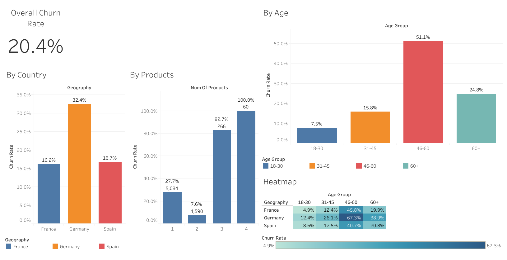

# Bank Customer Churn Analysis

**Question:** Which customers are leaving the bank, and which segments should retention efforts target?

**Data:** Kaggle "Bank Customer Churn Records", 10,000 customers, 18 columns (`data/Customer-Churn-Records.csv`)

## Files
- `churn_analysis.ipynb`: cleaning in pandas, writes `data/churn_clean.csv`
- `queries.sql`: SQLite queries for the analysis
- `dashboard_screenshot.png`: screenshot of the Tableau dashboard

## Dashboard
[Interactive dashboard on Tableau Public](https://public.tableau.com/views/BankCustomerChurn_17907038864420/Dashboard1)

## Data cleaning
No missing values, duplicate rows or duplicate customer IDs. Dropped `RowNumber`, `CustomerId` and `Surname`, and added `AgeGroup` and `BalanceTier` segments. 36% of customers have a zero balance. `Complain` is left out of the driver analysis because it nearly duplicates the outcome (99.5% of complainers churned).

## Top findings
Overall churn is **20.4%**.
1. **Age 46-60 churn at 51.1%** versus 15.8% for ages 31-45. Inactive 46-60 customers in Germany churn at 80.8%, about 4x the overall rate.
2. **Germany churns at 32.4%**, twice France (16.2%) and Spain (16.7%).
3. **Product count is non-linear.** Customers with 1 product churn at 27.7%, with 2 products only 7.6%, and with 3-4 products 83-100% (only 326 customers).

Inactive members churn at 26.9% versus 14.3% for active members. Inactive customers in the top balance tier (1,247 people) churn at 30.5%, and the churned ones held about $56.9M in balances.

## Personal Recommendation
Target inactive customers aged 46-60, starting in Germany, with retention offers. Encourage single-product customers to take a second product, since 2-product customers churn least. Review why 3-4 product customers leave almost universally.
